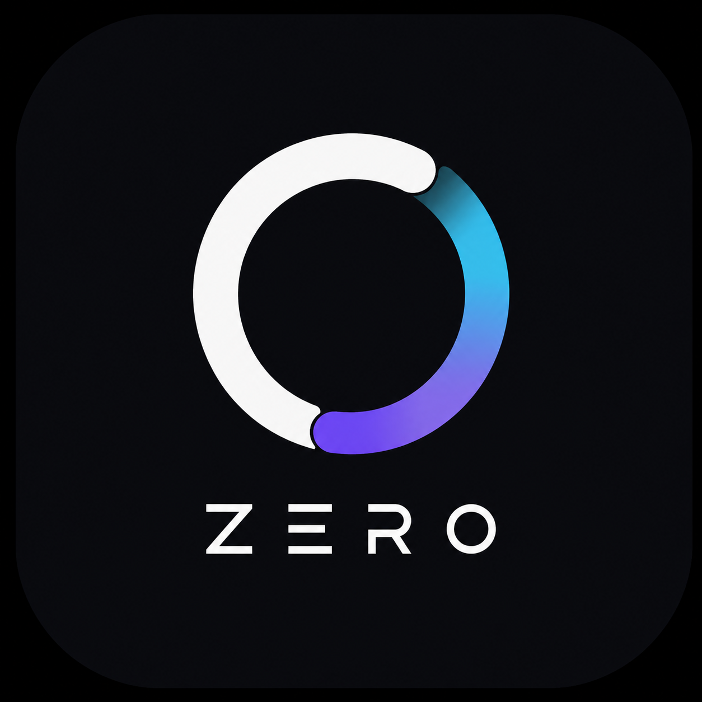
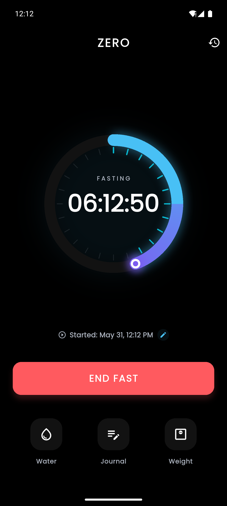
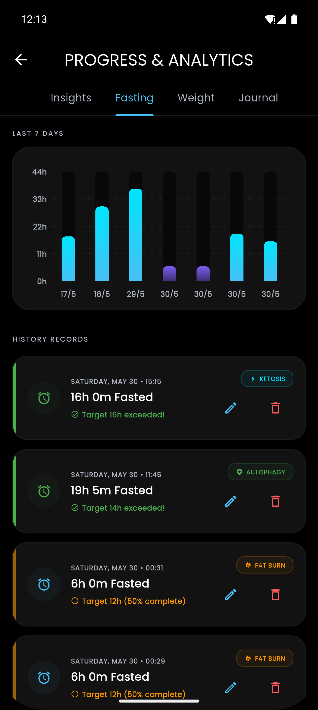
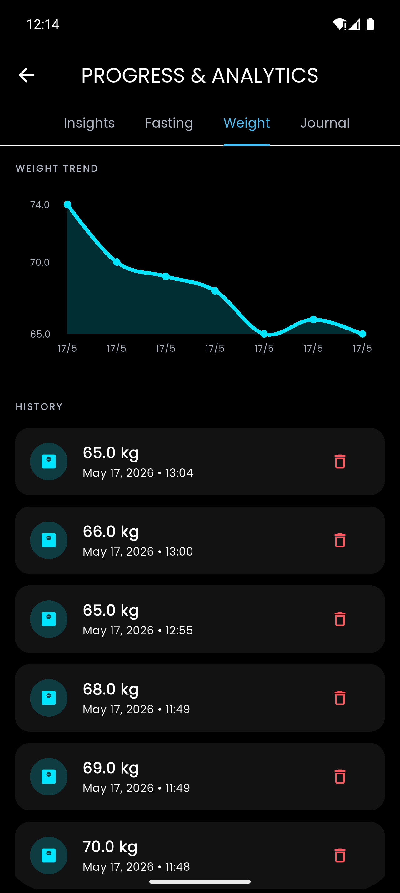
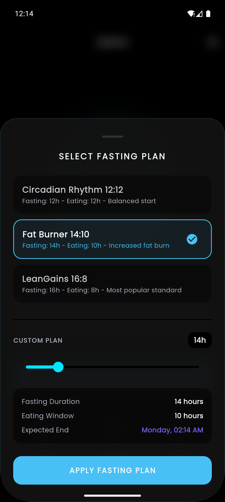
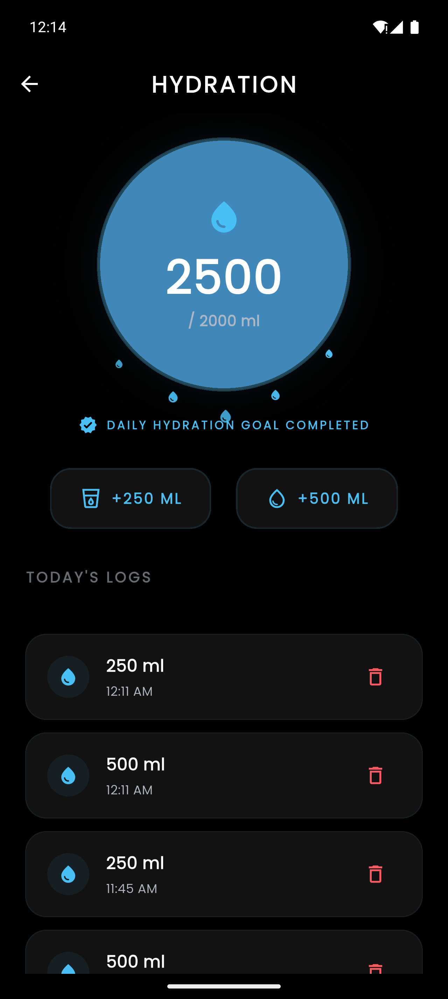
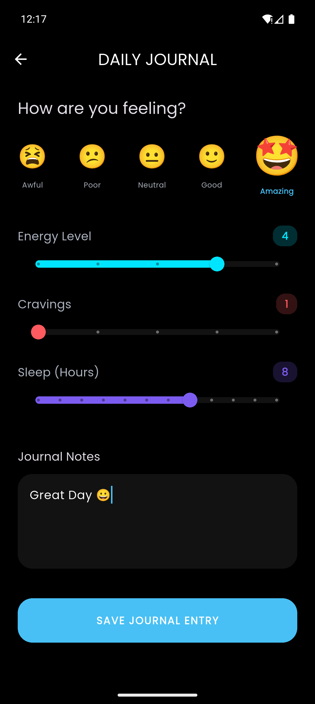

<div align="center">



# Zero

A premium, mindful fasting companion designed with clean aesthetics, smooth interaction, and a local-first philosophy. Zero goes beyond simple timers to deliver a serene space for tracking your fasts, hydration, weight, and mental well-being.

<br/>

[](https://flutter.dev)
[](https://dart.dev)
[](https://riverpod.dev)
[](https://pub.dev/packages/hive_ce)
[](https://flutter.dev/multi-platform/mobile)

</div>

---

## Screenshots

<div align="center">
<table>
  <tr>
    <td align="center"><br/><sub><b>Active Fast</b></sub></td>
    <td align="center"><br/><sub><b>Fasting Analytics</b></sub></td>
    <td align="center"><br/><sub><b>Weight Tracking</b></sub></td>
  </tr>
  <tr>
    <td align="center"><br/><sub><b>Plan Selector</b></sub></td>
    <td align="center"><br/><sub><b>Hydration</b></sub></td>
    <td align="center"><br/><sub><b>Daily Journal</b></sub></td>
  </tr>
</table>
</div>

---

## ✨ Features

- **Zen Fasting Engine:** Beautiful, custom-drawn sweep gradient progress circle featuring dynamic goal-reached celebrations.
- **Dynamic Motivation Overlay:** Random, curated motivational quotes paired with progress-aware encouragement that gracefully welcomes you back whenever you open the app.
- **Mindful Journaling:** Staggered slider entries to log daily mood and energy levels alongside notes, allowing you to reflect on historical trends.
- **Aesthetic Hydration & Weight Logs:** Premium micro-animations and quick-action modals to capture your daily balance indicators effortlessly.
- **Analytical Insights:** Dynamic charts that plot your fasting consistency and weight trajectory over time.

---

## 🛠️ Architectural Pillars

Zero is crafted using modern, industry-standard patterns that prioritize performance and robust developer experience:

- **Feature-First Modularity:** Code is grouped logically by feature, making the codebase highly readable, maintainable, and scalable.
- **Predictable State Management:** Utilizing **Riverpod** to enforce clean unidirectional data flow and highly reactive UI updates.
- **Offline-First Persistence:** Fully powered by **Hive CE** local storage for instant cold-starts, seamless performance, and absolute user privacy.
- **Fluid Motion Language:** Staggered entrance animations, shimmers, and glassmorphic blurs curated to deliver a tactile and high-end feel.

---

## Tech Stack

| Layer | Technology |
|---|---|
| Mobile Framework | Flutter |
| Language | Dart |
| State Management | Riverpod |
| Local Database | Hive CE |
| Routing | GoRouter |
| Charts | FL Chart |
| Animations | Flutter Animate |
| Notifications | Flutter Local Notifications |
| Typography | Google Fonts |
| Code Generation | Build Runner + Hive CE Generator |
| Platform | Android / iOS |

---

## 🚀 Getting Started

### Prerequisites

Ensure you have the latest **Flutter SDK** installed and configured on your machine.

### Quick Start

1. **Clone the repository and fetch dependencies:**
   ```bash
   flutter pub get
   ```

2. **Generate Database TypeAdapters (if required):**
   ```bash
   dart run build_runner build --delete-conflicting-outputs
   ```

3. **Run the application:**
   ```bash
   flutter run
   ```

---

## 🎨 Color Palette & Assets

Zero is designed with a pure black background and vibrant highlights matching its custom brand identity:
- 🌌 **Midnight:** `#000000` (Pure Black base)
- 🔹 **Teal Glow:** `#48C0F5` (Logo Highlight / Primary)
- 🔸 **Zen Purple:** `#7C5CF0` (Logo Accent / Secondary)
